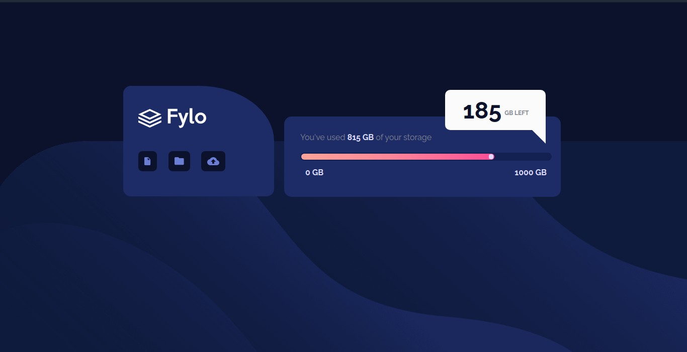

# FYLO Project.

I'd be recreating the FYLO design from https://frontendmentor.io 
The project will be built with HTML and SASS.

## Mobile version

The mobile version below is optimized for small screens. This was my very first project so, it contains a lot of errors. I was able to practice responsive design with media queries.

## Desktop Version
Here's desktop version 

