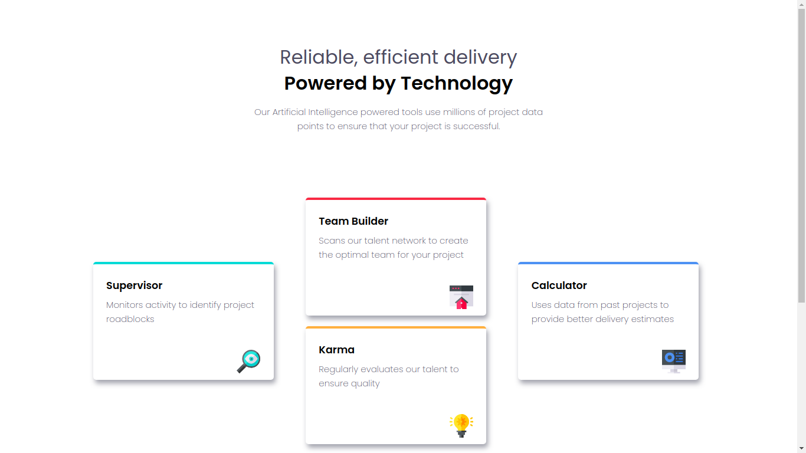

# Four card front-end mentor challenge

This was a very exciting challenge. I used the CSS grid to position the cards. It helped solidified the knowledge I had gained.

## Desktop Preview

Here's the [Live Preview](https://grid-card.netlify.app/)
